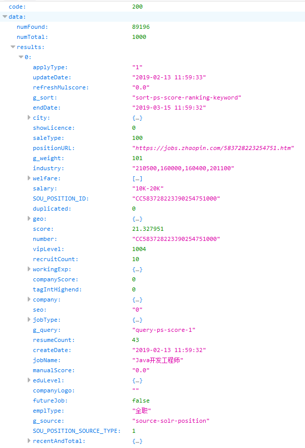
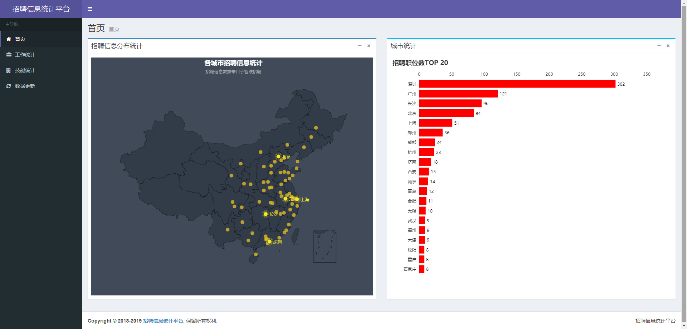
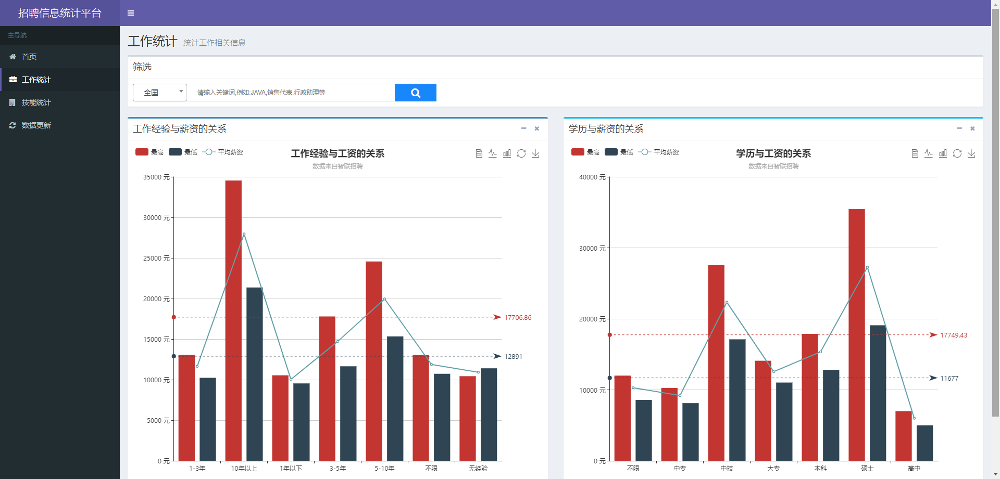
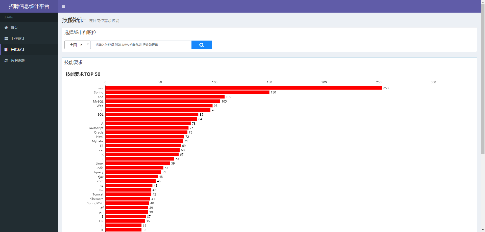

# 招聘信息统计平台

## 1.数据来源

  ~~招聘信息的数据来源为智联招聘，根据智联搜索规则对工作内容进行爬取分析并入库。~~

  ~~例如链接：~~

  ~~[http://sou.zhaopin.com/jobs/searchresult.ashx?jl=深圳&kw=java](http://sou.zhaopin.com/jobs/searchresult.ashx?jl=深圳&kw=java) （jl是**城市**，kw为**职位名**），~~
  ~~根据此url解析第一页获取工作数量，智联招聘一页最多显示60条工作职位的信息，一共最多显示90页，~~
  ~~所以我们根据获取的工作数量来确定需要抓取数据的页数，条数大于90页的则获取90页，小于90页的则使用实际页数。~~
  ~~然后根据页数构建出最终的url：[http://sou.zhaopin.com/jobs/searchresult.ashx?jl=深圳&kw=java&p=1](http://sou.zhaopin.com/jobs/searchresult.ashx?jl=深圳&kw=java&p=1)（p为页码）。~~
  ~~最后抓取每一页上对应具体工作的url所对应的工作信息及其公司信息。~~

### 2019/2/13更新

==以上抓取方式为老版智联，已不适用于新版本==

现在的实现方式是：直接将智联搜索页缓存到项目中，删除部分代码（如首次进入页面会弹出的提示、进入页面立即发送搜索请求等）。

智联搜索数据的请求链接格式为：<https://fe-api.zhaopin.com/c/i/sou?pageSize=90&cityId=489&salary=0,0&workExperience=-1&education=-1&companyType=-1&employmentType=-1&jobWelfareTag=-1&kt=3&=0>，利用ajaxhook对所有以<https://fe-api.zhaopin.com/c/i/sou?>开头的请求进行拦截，拦截后转发给后端进行抓取。

同时，新版智联的列表页由原来的同步变成了异步获取，通过请求上面的链接会得到类似于下面的json格式的数据，通过分析数据可获得职位的一些基本信息。

## 2.使用技术

  java框架使用的是[SpringBoot](http://spring.io/projects/spring-boot)，HTML解析器使用的是[Jsoup](https://jsoup.org/)，数据可视化使用的是百度的Javascript的图表库[ECharts](http://echarts.baidu.com/)，数据库为[MySQL](https://www.mysql.com/)，通过[Redis](https://redis.io/ )对抓取到的链接进行去重处理......

3.界面截图
----------

